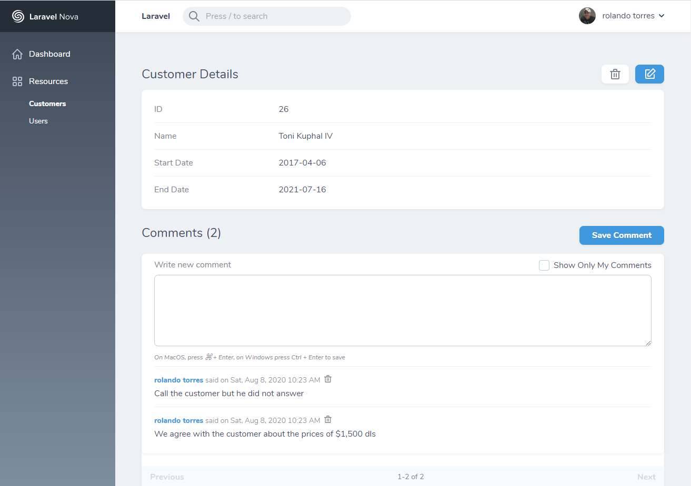

# Laravel Nova Comments Package
 
### Comments
    
#### Allow to add comments for a resource by a user. It manages the pagination in the backend

### How to use

```
    Comments::make()
        //->showOnlyMyComments(true)
        //->showOnlyMyComments(false)
        ->showOnlyMyComments() //default=true
        //->allowToShowAllCompaniesComments()  // Could be use for the system admin
        ->per_page(3),
```

### How to install

#### 1) Install the component with composer, run the below command:

        composer require ronnytorres/comments

#### 2) Add in the User table the field company_id, it could be null

        $table->bigInteger('company_id')->nullable();

#### 3) The componenet needs a Comment Model to be created.

        <?php

        namespace App\Models;

        use Illuminate\Database\Eloquent\Model;
        use Illuminate\Database\Eloquent\SoftDeletes;

        class Comment extends Model
        {
            use SoftDeletes;

            protected $dates = ['created_at'];
        }

#### 4) A migration exist to create the database table to store the comment for the nova resource.

         Schema::create('comments', function (Blueprint $table) {
            $table->bigIncrements('id');
            $table->string('resourceName');
            $table->string('resourceId');
            $table->text('text');
            $table->text('company_id')->nullable();
            $table->integer('user_id');
            $table->softDeletes();
            $table->timestamps();

            $table->index(['resourceId','resourceName', 'user_id', 'created_at']);
        });

#### 5) A CommentPolicy must be created

        <?php

        namespace App\Policies;

        use App\Models\User;
        use NovaComponents\Comments\Models\Comment;
        use Illuminate\Auth\Access\HandlesAuthorization;

        class CommentPolicy
        {
            use HandlesAuthorization;

            /**
            * Determine whether the user can view any models.
            *
            * @param  \App\Models\User  $user
            * @return mixed
            */
            public function viewAny(User $user)
            {
                return true;
            }

            /**
            * Determine whether the user can view the model.
            *
            * @param  \App\Models\User  $user
            * @param  \App\Models\Comment  $comment
            * @return mixed
            */
            public function view(User $user, Comment $comment)
            {
                return true;
            }

            /**
            * Determine whether the user can create models.
            *
            * @param  \App\Models\User  $user
            * @return mixed
            */
            public function create(User $user)
            {
                return true;
            }

            /**
            * Determine whether the user can update the model.
            *
            * @param  \App\Models\User  $user
            * @param  \App\Models\Comment  $comment
            * @return mixed
            */
            public function update(User $user, Comment $comment)
            {
                return true;
            }

            /**
            * Determine whether the user can delete the model.
            *
            * @param  \App\Models\User  $user
            * @param  \App\Models\Comment  $comment
            * @return mixed
            */
            public function delete(User $user, Comment $comment)
            {
                return true;
            }

            /**
            * Determine whether the user can restore the model.
            *
            * @param  \App\Models\User  $user
            * @param  \App\Models\Comment  $comment
            * @return mixed
            */
            public function restore(User $user, Comment $comment)
            {
                return true;
            }

            /**
            * Determine whether the user can permanently delete the model.
            *
            * @param  \App\Models\User  $user
            * @param  \App\Models\Comment  $comment
            * @return mixed
            */
            public function forceDelete(User $user, Comment $comment)
            {
                return true;
            }
        }

Additional Information
- The file api.php has the backend code instead of a the Controller. 

### Resoure Example


